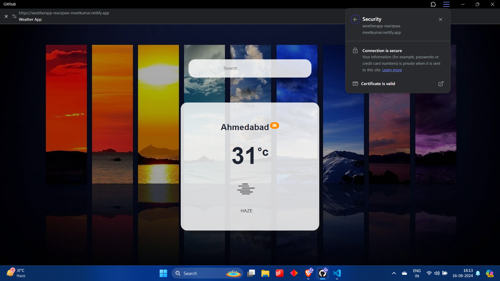

# WeatherApp React PWA

## Overview

WeatherApp is a Progressive Web App (PWA) built with React. It allows users to search for weather information based on their location or city name. The app fetches weather data from the OpenWeatherMap API and provides a user-friendly interface to display the current weather conditions.

## Features

- Search for weather by city name
- Displays current temperature, weather conditions 
- Responsive design for various devices
- Offline support as a Progressive Web App

## Performance

### Before PWA Optimization


*Before PWA optimization, the app experienced slower load times and lacked offline support. Users encountered delays and reduced performance.*

### After PWA Optimization




*After PWA optimization, the app's load times improved significantly, and offline functionality was enabled, resulting in a smoother user experience.*

## Live Demo

You can check out the live demo of the Weather App PWA here: [Live Demo](https://weatherapp-reactpwa-meetkumar.netlify.app/)


## Installation

To get started with WeatherApp, follow these steps:

1. **Clone the repository:**

   ```bash
   git clone https://github.com/MeetkumarChavda/weatherapp_react_pwa.git
   ```

2. **Navigate to the project directory:**

   ```bash
   cd weatherapp_react_pwa
   ```

3. **Install dependencies:**

   ```bash
   npm install
   ```

4. **Update the `homepage` field in `package.json`:**

   If deploying to a specific URL, update the `homepage` field in `package.json` with your deployed URL:

   ```json
   "homepage": "https://yourdomain.com"
   ```

5. **Build the project:**

   ```bash
   npm run build
   ```

6. **Serve the build folder locally (optional):**

   ```bash
   npm install -g serve
   serve -s build
   ```

## Usage

1. **Start the development server:**

   ```bash
   npm start
   ```

2. **Open your browser and navigate to `http://localhost:3000` to see the app in action.**

3. **Enter a city name in the search bar and press Enter to fetch the weather data.**

## API

WeatherApp uses the [OpenWeatherMap API](https://openweathermap.org/api) to fetch weather data. You will need an API key to access the weather information.

1. **Sign up at OpenWeatherMap and get your API key.**
2. **Replace `YOUR_API_KEY` in `fetchWeather.js` with your actual API key.**

   ```js
   const API_KEY = 'YOUR_API_KEY';
   ```

## Deployment

To deploy your app, follow these steps:

1. **Update the `homepage` field in `package.json` as described in the Installation section.**
2. **Build the project:**

   ```bash
   npm run build
   ```

3. **Deploy the `build` folder to your preferred hosting provider.**

For more information about deploying React apps, visit [Create React App Deployment](https://cra.link/deployment).

## Contributing

Contributions are welcome! If you have suggestions or improvements, please submit a pull request or open an issue.

## License

This project is licensed under the MIT License. See the [LICENSE](LICENSE) file for details.

## Contact

For any questions or feedback, you can reach me at [meetkumar.chavda785@gmail.com](mailto:meetkumar.chavda785@gmail.com).

---

